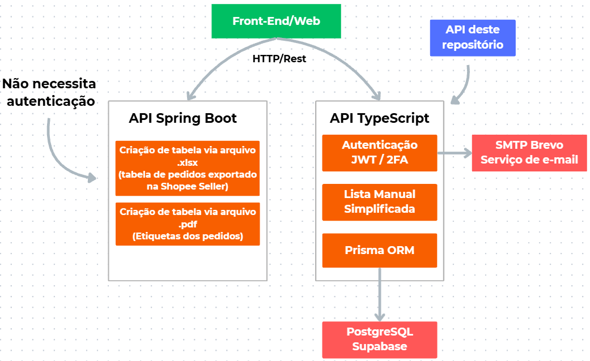

# ➜ API em TypeScript — Shopee Supplier Calculator

Shopee Supplier Calculator: https://shopee-supplier-calculator.netlify.app

O Shopee Supplier Calculator foi desenvolvido para auxiliar o gerenciamento financeiro de um grupo de comerciantes virtuais que possuem lojas centralizadas na plataforma da Shopee.

Ao comercializar produtos pela internet, é importante possuir uma forma eficiente de **registrar** os pedidos em **tabelas** ou **planilhas**. Entretanto, os comerciantes enfrentavam dificuldades nesse processo: o registro manual dos pedidos é repetitivo, trabalhoso e suscetível a erros, além da necessidade de calcular manualmente métricas como lucro e taxas de fornecedores.

Diante desse problema, surgiu a necessidade de **automatizar** e **simplificar** o gerenciamento dos pedidos, reduzindo o trabalho manual e a possibilidade de erros no preenchimento dos dados.

### ➜ Soluções propostas

Com base no problema identificado, foram propostas duas soluções:

- ***Solução 1***: facilitar o registro manual dos pedidos por meio de uma tabela simplificada, realizando automaticamente o cálculo de algumas métricas.

- ***Solução 2***: criar uma tabela totalmente automatizada, na qual o usuário precisa apenas fornecer um arquivo contendo as informações dos pedidos.

Esta API desenvolvida em TypeScript é responsável pela solução 1.

A proposta é fornecer ao usuário uma forma **simplificada** de **cadastrar** e **acompanhar** seus pedidos, mantendo o controle sobre os registros e apresentando as principais métricas sem a necessidade de realizar cálculos **manualmente**.

A API responsável pela solução 2 está disponível em outro repositório.
Repositório: LINK

### ➜ O que essa API faz?

A primeira premissa do projeto foi **simplificar** o processo de registro dos pedidos.

Antes da aplicação, era necessário informar manualmente dados como:

- SKU.
- ID do pedido.
- Data.
- Rendimento líquido.
- Quantidade.
- Entre outras informações.

Além disso, era necessário calcular **manualmente** métricas como lucro e taxa do fornecedor.

A API automatiza esses cálculos com base nos dados fornecidos pelo usuário.

Entre as métricas calculadas automaticamente estão:

- Lucro do pedido.
- Taxa do fornecedor, calculada com base nos SKUs.
- Rendimento líquido.
- Totais acumulados da tabela.
- Soma das métricas dos pedidos cadastrados.

Dessa forma, ao cadastrar um novo pedido, a API também atualiza automaticamente as métricas totais da tabela.

### Fluxo desejado:

````
    Usuário informa dados básicos dos pedidos em um formulário
                            |
                            ▼
        API calcula métricas (lucro e taxa de fornecedor)
                            |
                            ▼
      API atualiza as métricas totais (inclui o novo pedido)
                            |
                            ▼
                Pedido é inserido na tabela
                            |
                            ▼
Tabela e métricas totais atualizadas são retornadas para o usuário
````

Como cada usuário poderá ter uma tabela diferente entre si, foi implementada um sistema de **autenticação**.

### ➜ Autenticação

A autenticação é feita via  ``JWT`` (JSON Web Token).

Todas as rotas requerem um token válido, exceto as rotas de login e cadastro.

O fluxo de autenticação utiliza:

- ``Access Token`` e ``Refresh Token``
- Middlewares de autenticação
- Autenticação de duas etapas (``2FA``)
- Código de verificação via e-mail
 
### ➜ Autenticação de duas etapas (``2FA``)

Após o login, um **código de verificação** é enviado para o e-mail informado no formulário.

O código possui regras de validações como: expiração, quantidade de tentativas, código já utilizado e etc.

O envio dos códigos é via ``SMTP`` da **Brevo**,

### Fluxo de autenticação:

````
Usuário informa e-mail e senha no login
                |
                ▼
    API verifica as credenciais
                |
                ▼
API envia código de verificação via e-mail (2FA)
                |
                ▼
Usuário informa o código de verificação
                |
                ▼
        API valida o código
                |
                ▼
        API gera os tokens 
````

#### Recuperação de senha

O sistema conta com um fluxo de **recuperação de senha**.

Quando o usuário solicita a alteração de senha, um mecanismo temporário é criado e o link de recuperação de senha é enviado via e-mail.

O serviço de alteração de senha utiliza o ``SMTP`` da **Brevo**.

### ➜ Persistência dos dados

Os dados do sistema são persistidos em um banco de dados ``PostgreSQL``, hospedado no **Supabase**.

Entre os dados persistidos, estão:

- Dados de cadastro do usuário (Nome, e-mail e senha).
- Refresh Tokens.
- Códigos e tentativas de login.
- Tentativas de alteração de senha.
- Pedidos cadastrados manualmente.

Para a comunicação entre o banco de dados, o sistema utiliza o Prisma ORM.

### ➜ Serviço de Email

A API possui um serviço de envio de e-mails utilizando ``SMTP`` da **Brevo**.

Atualmente, o serviço é utilizado principalmente para:

- Códigos de autenticação em dois fatores.
- Links de recuperação/alteração de senha.

### ➜ Arquitetura



### ➜ Stack

Tecnologias utilizadas nesta API:

- Node.js | Runtime
- TypeScript | Desenvolvimento da API
- Prisma ORM | Comunicação com o DB    
- PostgreSQL | DB utilizado para persistência de dados
- SMTP da Brevo | Serviço de e-mail
- Supertest | Testes de integração      
- Vitest | Testes unitários
- JWT | Autenticação
- Supabase | Hospedagem do DB
- Git Actions | CI/CD


